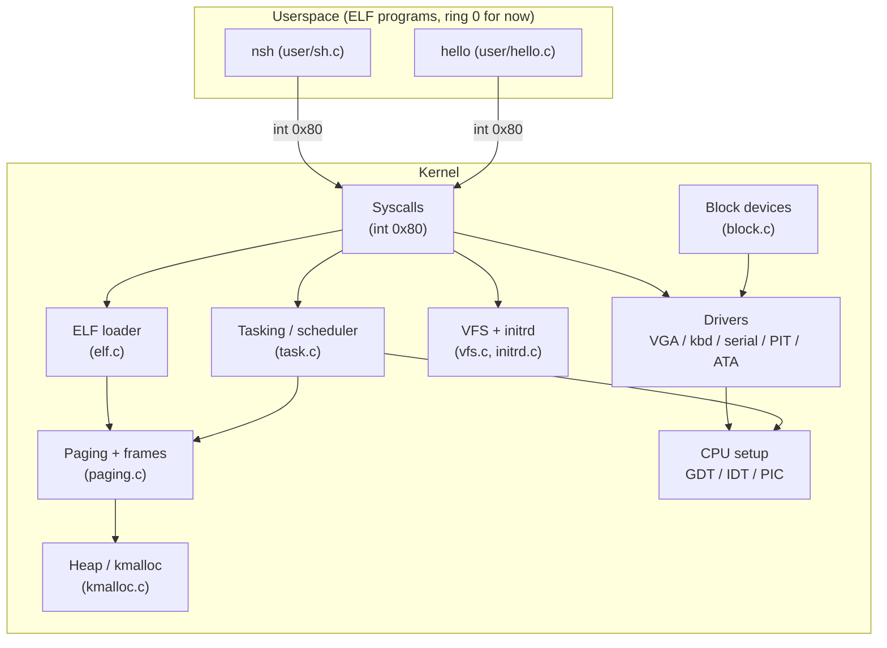
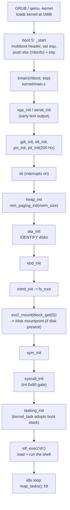
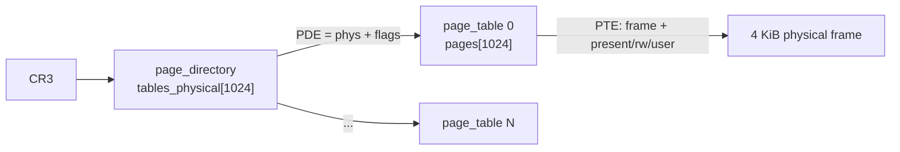
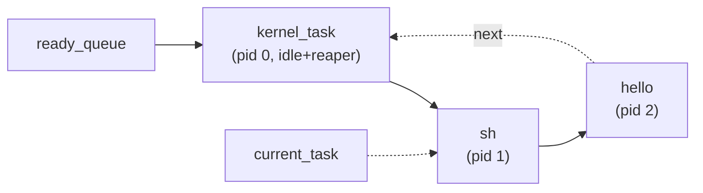
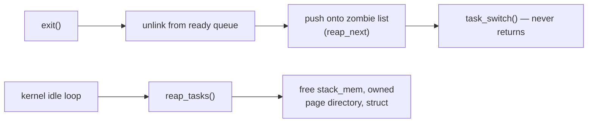
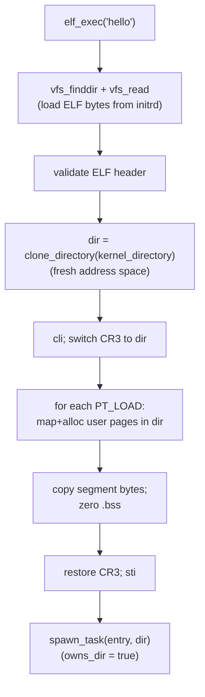

# NOS Architecture

A guided tour of the NOS kernel: how it boots, manages memory, schedules tasks,
serves system calls, and runs userspace programs. Diagrams are [Mermaid](https://mermaid.js.org/)
and render on GitHub.

NOS is a small 32-bit x86 (i686), single-core, protected-mode kernel booted via
Multiboot (GRUB or `qemu -kernel`). Today everything runs in **ring 0** and the
design is deliberately *syscall-first*, so moving programs to ring 3 later is an
additive change.

## Table of contents

1. [Big picture](#1-big-picture)
2. [Building and running](#2-building-and-running)
3. [Boot sequence](#3-boot-sequence)
4. [Segmentation and interrupts](#4-segmentation-and-interrupts)
5. [Physical memory and paging](#5-physical-memory-and-paging)
6. [The kernel heap (kmalloc)](#6-the-kernel-heap-kmalloc)
7. [Virtual address space](#7-virtual-address-space)
8. [Tasking and scheduling](#8-tasking-and-scheduling)
9. [System calls](#9-system-calls)
10. [ELF loading and per-process address spaces](#10-elf-loading-and-per-process-address-spaces)
11. [Userspace](#11-userspace)
12. [VFS and initrd](#12-vfs-and-initrd)
13. [Drivers](#13-drivers)
14. [Known limitations and what's next](#14-known-limitations-and-whats-next)
15. [Source map](#15-source-map)

---

## 1. Big picture



The kernel is a flat set of C modules linked into a single ELF (`kernel.elf`)
that loads at physical **1 MiB**. A separate initrd (a tar file) carries the
symbol table and the userspace programs.

---

## 2. Building and running

```
make            # build kernel.elf
make initrd     # (re)build initrd/initrd.tar: symbol table + user programs
make run        # boot in QEMU with the initrd, serial on stdio
```

- Toolchain: `i686-elf-gcc` / `i686-elf-ld` / `i686-elf-as` (a freestanding
  cross toolchain), flags `-ffreestanding -nostdlib`.
- `linker.ld` places the kernel at `1M` and defines `kernel_base` / `kernel_end`.
- Userspace programs are built separately and linked at `0x40000000` via
  `user/user.ld`, then bundled into the initrd (see the `USERPROGS` rule).
- The initrd's `symtable` (from `nm -n kernel.elf`) is loaded at boot so panics
  can print symbolic stack traces (see [DEBUGGING.md](DEBUGGING.md)).

---

## 3. Boot sequence

`boot/boot.S` provides the Multiboot header, sets up a temporary stack, pushes
the Multiboot info pointer and boot `esp`, and calls `kmain`.



After `kmain` reaches its idle loop, the kernel task does nothing but reap dead
tasks and `hlt`; the timer interrupt drives everything else. `kmain` never
returns.

---

## 4. Segmentation and interrupts

### GDT (`kernel/gdt.c`)

A flat segmentation model — every segment spans the full 4 GiB; paging does the
real work. Five descriptors:

| Selector | Descriptor        | Ring |
|----------|-------------------|------|
| `0x00`   | null              | —    |
| `0x08`   | kernel code       | 0    |
| `0x10`   | kernel data       | 0    |
| `0x18`   | user code         | 3    |
| `0x20`   | user data         | 3    |

The ring-3 descriptors exist but aren't used yet (no TSS, so no ring 3 → see
[§14](#14-known-limitations-and-whats-next)).

### IDT and PIC (`kernel/idt.c`, `kernel/pic.c`)

- The PIC is remapped so hardware IRQs don't collide with CPU exception vectors:
  master IRQs start at **0x20** (so timer IRQ0 → vector 32, keyboard IRQ1 → 33).
- CPU exceptions 0–18 get dedicated handlers; everything else gets a default
  handler. All are **interrupt gates** (`0x8E`, DPL 0) — they clear IF, so
  handlers aren't re-entered.
- The syscall vector `0x80` is a **trap gate** at DPL 3 (`0xEF`): callable from
  ring 3 and leaves IF as it was, so the timer/keyboard keep ticking during a
  syscall (see [§9](#9-system-calls)).

The assembly stubs live in `kernel/interrupt.S`. Each saves registers, calls a C
handler, sends the PIC End-Of-Interrupt where needed, restores, and `iret`s.
The `SAVE_REGS` / `RESTORE_REGS` macros define the **trap frame** that the whole
tasking and syscall system is built around ([§8](#8-tasking-and-scheduling)).

The PIT (`kernel/pit.c`) is programmed to **200 Hz**; its IRQ0 is the scheduler's
heartbeat.

---

## 5. Physical memory and paging

`kernel/paging.c` manages physical frames with a **bitset** (`frames`) — one bit
per 4 KiB frame, sized to real RAM (from Multiboot `mem_upper`, [§3](#3-boot-sequence)).
`alloc_frame` finds a free bit; `free_frame` clears it.

Page tables use the standard two-level x86 structure:



Key structures (`include/mm.h`):
- `struct page` — one 32-bit PTE: `present`, `rw`, `user`, `accessed`, `dirty`,
  and a 20-bit `frame` index.
- `struct page_table` — 1024 pages (covers 4 MiB).
- `struct page_directory` — 1024 `page_table*` (virtual, for the kernel to walk),
  1024 `tables_physical` entries (the actual PDEs CR3 points at), and `phys_addr`
  (the physical address of `tables_physical`, used to load CR3).

At init, `mm_paging_init` builds `kernel_directory`, **identity-maps** `0 …
heap_end` (so the kernel, its heap, and page tables are all reachable at their
physical addresses), enables paging, then clones the directory into
`current_directory` and runs on that.

`clone_directory(src)` makes a new address space that **shares** `src`'s tables
that are identical to the kernel directory's (the low identity map) and **copies**
the rest. Cloning `kernel_directory` therefore yields a fresh space with the
kernel/heap visible and the user region empty — exactly what the ELF loader wants
([§10](#10-elf-loading-and-per-process-address-spaces)).

---

## 6. The kernel heap (kmalloc)

`kernel/kmalloc.c` is a first-fit heap that lives just above the kernel image
(`kernel_end + 0xF000`, page-aligned) and is 600 pages (~2.4 MiB) today.

Every allocation is a header immediately followed by its payload:

```
  +--------+-------------------+--------+-------------------+ ...
  | alloc  |  payload (size)   | alloc  |  payload          |
  | {size, |                   | {size, |                   |
  |  status}                   |  status}                   |
  +--------+-------------------+--------+-------------------+
  ^ next block starts at payload_end = header + 8 + size
```

- `kmalloc(size)` — first free block that fits (`status == 0`).
- `kmalloc_a(size)` — page-aligned payload (for page tables/directories); carves
  a small free "padding" block before the aligned one when needed.
- `kmalloc_ap` / `kmalloc_p` — as above, but also return the physical address.
- `kfree(ptr)` — flips the block to free.

> **Note / gotcha:** allocation sizes are rounded up to a multiple of the header
> size so block boundaries stay on-grid — an odd-sized allocation used to shift
> every following header and break the free-list walk. This allocator does *not*
> split large reused blocks or coalesce on free; it's simple, not efficient.

---

## 7. Virtual address space

Because the low region is identity-mapped and shared by every address space, the
kernel, heap, and each task's kernel stack are reachable no matter which page
directory is active. User programs get their own high region per process.

```
  0xFFFFFFFF ┌───────────────────────────┐
             │        (unmapped)         │
  0x40000000 ├───────────────────────────┤  ← user program image + stack
             │  USER: this process only  │     (its own page table; each
             │  code / data / bss / stk  │      process links here, no clash)
             ├───────────────────────────┤
             │        (unmapped)         │
   heap_end  ├───────────────────────────┤
             │   kernel heap (kmalloc)   │  ┐
             │   ~2.4 MiB                 │  │ identity-mapped,
   ~0x11c000 ├───────────────────────────┤  │ SHARED by every
             │   kernel image (.text/    │  │ address space
     0x100000│    .data/.bss) @ 1 MiB    │  │
             ├───────────────────────────┤  │
             │  low mem / BIOS / VGA      │  ┘  (VGA text buffer @ 0xB8000)
  0x00000000 └───────────────────────────┘
```

Two programs can both link at `0x40000000`: they live in *different* page
directories, so the identical virtual address maps to different physical frames.

---

## 8. Tasking and scheduling

### The task and the ready queue

`struct task` (`include/task.h`) holds a saved kernel-stack pointer (`esp`), the
stack allocation (`stack_mem`), the `page_directory`, and links (`next` for the
round-robin ready queue, `reap_next` for the zombie list). Tasks form a circular
single-linked ready queue; `current_task` points at the running one.



### The unified context switch

This is the heart of the kernel. **Both** the timer interrupt and the
cooperative `task_switch()` yield build the *same* trap frame and hand it to one
C function, `schedule()`:

```
  low addr (esp) ──►  gs fs es ds  edi esi ebp esp ebx edx ecx eax  eip cs eflags
                      └── segments ┘ └──── pushad ────┘             └─ iret frame ┘
```

`schedule(esp)` (`kernel/task.c`) saves the outgoing task's `esp`, advances
`current_task` round-robin, reloads CR3 if the address space changed, and returns
the incoming task's `esp`. The assembly then swaps `esp`, sends EOI (timer path
only), restores registers, and `iret`s into the next task.

```mermaid
sequenceDiagram
    participant T as Running task
    participant IRQ as _asm_irq_0 (timer)
    participant S as schedule()
    participant N as Next task
    T->>IRQ: PIT fires (IF was set)
    IRQ->>IRQ: SAVE_REGS (build trap frame on T's stack)
    IRQ->>S: schedule(esp)
    S->>S: current_task->esp = esp
    S->>S: pick next; reload CR3 if dir changed
    S-->>IRQ: return next->esp
    IRQ->>IRQ: mov esp, next->esp; send EOI; RESTORE_REGS
    IRQ->>N: iret → resumes N exactly where it was
```

Because a freshly `spawn_task`'d task is given a **hand-built trap frame** that
looks exactly like one left by a timer preemption (segments + `pushad` + an
`iret` frame with `eip = entry`, `cs = 0x08`, `eflags = IF set`), the very first
switch into it is indistinguishable from resuming a preempted task. No special
first-run path.

`task_switch()` (in `interrupt.S`) is the cooperative twin: it manually pushes
the same frame, `cli`s for atomicity, calls `schedule()`, and `iret`s. It's used
by `mutex_lock` (spin-yield) and by blocking syscalls like `getc`/`wait`.

### Exit and reaping

A task can't free the stack it's running on, so teardown is deferred:



`reap_tasks()` runs from the idle loop (a *different* stack and address space),
so it can safely free a zombie's kernel stack and, for programs with their own
address space, its page directory (`free_directory` releases the user page tables
and frames but keeps the shared kernel tables).

---

## 9. System calls

Userspace calls the kernel via `int 0x80`, Linux/i386-style: `eax` = number,
`ebx`/`ecx`/`edx` = args, return value in `eax`.

| # | Name          | Meaning                                   |
|---|---------------|-------------------------------------------|
| 0 | `SYS_EXIT`    | terminate the current task (never returns)|
| 1 | `SYS_WRITE`   | write bytes to the console                 |
| 2 | `SYS_GETC`    | read one key (blocking)                    |
| 3 | `SYS_READDIR` | name of the Nth directory entry            |
| 4 | `SYS_CLEAR`   | clear the screen                           |
| 5 | `SYS_EXEC`    | load+run a program, returns child pid      |
| 6 | `SYS_WAIT`    | block until a given pid exits              |

```mermaid
sequenceDiagram
    participant U as User program
    participant G as int 0x80 (trap gate, DPL3)
    participant A as _asm_syscall
    participant D as syscall_dispatch(regs*)
    U->>G: int 0x80 (eax=num, ebx/ecx/edx=args)
    G->>A: enter (IF unchanged → IRQs stay live)
    A->>A: SAVE_REGS (same trap frame as IRQs)
    A->>D: pass pointer to the saved frame
    D->>D: switch on regs->eax; do the work
    D->>D: write result into regs->eax
    A->>U: RESTORE_REGS; iret (eax = result)
```

The dispatcher reuses the exact trap-frame layout from `SAVE_REGS`
(`struct regs` in `include/syscall.h`), reads the arguments from it, and writes
the return value back into the saved `eax` slot so `popad` hands it to the
caller. The trap gate keeps interrupts enabled so blocking calls like `SYS_GETC`
(which waits on keyboard IRQs while yielding via `task_switch`) work.

---

## 10. ELF loading and per-process address spaces

`elf_exec(path)` (`kernel/elf.c`) turns a bundled ELF into a running task:



To write the program image to its link address (`0x40000000`), the loader must
make the new directory active — so it switches CR3 with interrupts off, copies,
then restores CR3 before returning. Since the new directory shares the kernel's
low identity map, the loader's own stack and the source buffer stay mapped the
whole time.

Every program gets its **own** address space, so many programs can link at the
same address without colliding — this is the groundwork ring 3 will sit on.

---

## 11. Userspace

A userspace program is a freestanding ELF that knows *nothing* about the kernel
except the `int 0x80` ABI. Example (`user/hello.c`):

```c
syscall3(SYS_WRITE, 1, (int)msg, len);
syscall3(SYS_EXIT, 0, 0, 0);
```

`user/sh.c` is **nsh**, the shell — loaded from the initrd at boot and run as its
own program. It reads keys with `SYS_GETC`, echoes with `SYS_WRITE`, and
dispatches a line:

- builtins: `help`, `ls` (via `SYS_READDIR`), `clear`, `exit`;
- anything else: `SYS_EXEC` it as a program, then `SYS_WAIT` for it to finish.
  Pipelines (`|`), input redirection (`<`), and output redirection (`>`)
  are handled by the shell via `SYS_PIPE`/`SYS_EXEC2` and `SYS_OPENMODE`.

So typing `hello` loads and runs `/hello` in its own address space and returns to
the prompt when it exits. The shell and `hello` both link at `0x40000000` and
coexist because they're in separate page directories.

---

## 12. VFS, initrd, and ext2

`include/vfs.h` defines a minimal VFS node with function pointers
(`read`/`write`/`readdir`/`finddir`). `fs_root` is the root node — the initrd.

### Hierarchical path resolution

`vfs_resolve(path)` walks `/`-separated path components from `fs_root`, calling
`finddir` at each level. This lets the initrd root delegate `disk/...` paths to
the ext2 mountpoint, while flat names like `sh` still resolve to initrd files
exactly as before. `sys_open`, `sys_openmode`, `sys_listdir`, and `elf_exec`
all use `vfs_resolve` instead of the old single-level `vfs_finddir`.

### Initrd

The initrd (`kernel/initrd.c`) is a **ustar tar** passed as a Multiboot module.
`initrd_init` parses the tar into a flat list of file nodes (plus a synthetic
`dev` directory). Each file's `read` returns bytes straight out of the tar image
in memory. The initrd holds the symbol table and all user programs.

### ext2 mount

If the first ATA block device contains a valid ext2 filesystem, `ext2_mount`
(`kernel/ext2.c`) reads and validates the superblock, group descriptor, and
root inode, then installs the ext2 root as a `"disk"` entry in the initrd root's
`readdir`/`finddir`. The initrd remains the root filesystem; ext2 is accessible
only as `/disk/...`.

The ext2 driver supports:
- **Reads**: directory listing and lookup, regular-file reads through direct
  (blocks 0–11) and singly-indirect (block 12) block pointers.
- **Writes**: create/truncate/write of regular files in existing directories.
  `SYS_OPENMODE` with `O_CREATE`/`O_TRUNC`/`O_WRONLY` opens or creates a
  writable fd; `sys_write` routes `FD_FILE` writes through VFS with access-mode
  enforcement (the `FD_WRITABLE` flag).
- **Directory creation**: `SYS_MKDIR` creates a directory in an existing parent.
  The ext2 driver allocates an inode and one data block, initializes `.` and `..`
  records (mode 0755, links=2, size=1024, i_blocks=2), then persists the parent
  link-count and group `bg_used_dirs_count` increments before inserting the
  child entry. If any metadata write or the entry insertion fails, the count
  values are restored and the allocated inode/block are freed, so a failed
  mkdir leaves no dangling entry or stale counts. `bg_used_dirs_count` is
  bounds-checked against `s_inodes_count` before incrementing.
- **Metadata**: inode/block bitmaps, free counts in the superblock and group
  descriptor, inode size/block counts/link count, and directory entries are
  maintained on every mutation. Newly allocated blocks are zeroed. A per-mount
  mutex serializes reads as well as metadata/data writes.

Validation on mount: magic (0xEF53), revision 0, all three feature masks
(compat, incompat, ro-compat) zero, 1 KiB block size, one block group, 128-byte inodes,
non-zero geometry, in-range block/inode pointers, and valid directory record
lengths. Mounting never formats — an invalid filesystem is silently skipped.

Intentional limitations: no unlink, rmdir, symlinks, multi-block-group writes,
or journaling. The `disktest` user utility exercises listing, reads, and writes;
the `mkdir` utility creates directories from the shell.

---

## 13. Drivers

| Driver  | File                | Notes |
|---------|---------------------|-------|
| VGA     | `kernel/vga.c`      | 80×25 text at `0xB8000`; `vga_putc` handles `\n`, `\b`, scrolling in place |
| Keyboard| `drivers/keyboard.c`| PS/2; IRQ1 → scancode → ASCII into a bounded ring buffer; `kbd_getc` drains it |
| Serial  | `drivers/serial.c`  | COM1; mirrors console output (used for logging/tests) |
| PIT     | `kernel/pit.c`      | 200 Hz timer; IRQ0 drives the scheduler |
| ATA     | `drivers/ata.c`     | Legacy primary/secondary PIO; IDENTIFY plus bounded polling LBA28 reads, writes, and cache flush |
| ext2    | `kernel/ext2.c`     | Revision-0 ext2 read/write: mount validation, directory listing/lookup, file read (direct + singly-indirect), create/truncate/write, mkdir with bitmap/free-count/link-count maintenance; serialized by per-mount mutex |

`kprintf` writes to both VGA and serial (guarded by a mutex); `mprintf` prefixes
a module tag; `panic` prints a message and a symbolic stack trace, then halts.

`kernel/block.c` keeps a small registry of discovered 512-byte-sector devices
and validates every request against the device capacity before dispatching it.
ATA channels are mutex-serialized, and device interrupts stay disabled because
this first storage path uses bounded polling. The initrd remains the root
filesystem; ext2 is mounted as `/disk` when a valid filesystem is present on the
first ATA device. No raw disk interface is exposed to ring 3.

---

## 14. Known limitations and what's next

- **Ring 3 / user mode** is the big next step. The pieces already in place:
  ring-3 GDT segments, per-process page directories, an `int 0x80` gate at DPL 3,
  and syscall-only user programs. What's missing: a **TSS** (to hold the ring-0
  stack pointer `esp0` for the ring3→ring0 transition), and entering programs
  with an `iret` to the user segments instead of `0x08`. The `sh`/`hello`
  binaries won't need to change.
- **ext2** is limited to revision 0, 1 KiB blocks, one block group, no
  features. Supports read (direct + singly-indirect), create, truncate, write,
  and mkdir for existing parent directories. No unlink, rmdir, symlinks,
  multi-group writes, or journaling.
- **Heap** doesn't split or coalesce; fixed 2.4 MiB.
- **Scheduler** is plain round-robin, no priorities or sleeping (blocking calls
  busy-yield).
- **Mutex** is single-CPU only (masks interrupts).
- Single core; no SMP.

## 15. Source map

| Path | What |
|------|------|
| `boot/boot.S` | Multiboot header, entry, jump to `kmain` |
| `linker.ld` | Kernel layout (loads at 1 MiB) |
| `kernel/main.c` | `kmain`, init order, idle/reaper loop |
| `kernel/gdt.c` | Segments |
| `kernel/idt.c` | Interrupt descriptor table |
| `kernel/pic.c` | 8259 PIC remap |
| `kernel/pit.c` | Timer (200 Hz) |
| `kernel/block.c`, `drivers/ata.c` | Block-device registry and polling ATA PIO |
| `kernel/ext2.c`, `include/ext2.h` | ext2 rev-0 read/write filesystem |
| `kernel/interrupt.S` | ISR stubs, `SAVE/RESTORE_REGS`, `task_switch`, `_asm_syscall` |
| `kernel/isr.c` | C exception/IRQ handlers |
| `kernel/paging.c` | Frame allocator, page tables, `clone/free_directory` |
| `kernel/kmalloc.c` | Kernel heap |
| `kernel/task.c` | Tasks, `schedule`, `spawn_task`, `exit`, reaper |
| `kernel/syscall.c` | `int 0x80` dispatch and syscalls |
| `kernel/elf.c` | ELF loader |
| `kernel/vfs.c`, `kernel/initrd.c` | VFS (hierarchical path resolution) + initrd (tar) |
| `kernel/vga.c`, `drivers/keyboard.c`, `drivers/serial.c` | Drivers |
| `kernel/kernel.c` | `kprintf`/`mprintf`/`panic`, symbol table, stack traces |
| `user/sh.c`, `user/hello.c`, `user/disktest.c`, `user/mkdir.c`, `user/user.ld` | Userspace programs |
| `include/*.h` | Public headers for each subsystem |

---

*See also [DEBUGGING.md](DEBUGGING.md) for symbolic backtraces and QEMU/Bochs tips.*
